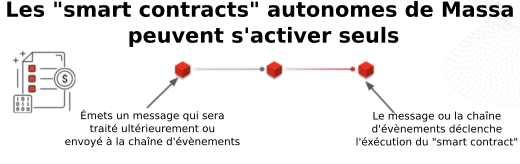

# Décentralisation. Pourquoi s’y intéresser ?

Traduction de “[Decentralization. Why should I care?](https://massalabs.medium.com/decentralization-why-should-i-care-8e9b6141d582)”

Depuis très longtemps, les **politiques de gestion des banques et de la monnaie** ont été imposées par des banques centrales, des gouvernements et des autorités étatiques. Ces organisations puissantes prennent des décisions importantes souvent entourées **d’opacités**. Elles peuvent être influencées par la corruption, sont coûteuses et généralement ne prennent pas les meilleures décisions car elles ne parviennent pas à recueillir et/ou traiter suffisamment d’informations pour agir de la façon la plus pertinente.

Grâce à l’utilisation de la technologie blockchain, le Bitcoin démontre que n’importe qui peut stocker et transférer de la valeur sans utiliser les services d’une banque existante. Ces technologies de blockchain ont élargi le champ d’application de la décentralisation au vote, à la propriété et à la finance. En respectant le principe **“le Code, c’est la Loi”**, les technologies de blockchain open-source procurent une transparence jamais atteinte pour les utilisateurs. Quiconque peut comprendre, vérifier les règles du jeu et même y prendre part au travers d’un système de vote décentralisé.

La décentralisation crée un environnement ou la confiance en une **autorité centrale n’est pas utile**. La censure n’est plus possible et les intermédiaires coûteux disparaissent. Les utilisateurs d’une plateforme décentralisée sont les acteurs de son fonctionnement et de sa gouvernance au lieu de suivre des règles sur lesquelles ils n’ont pas d’influence. Cependant, chaque technologie de blockchain possède ses caractéristiques propres qui régissent sont fonctionnement.

## Toutes les blockchains ne se valent pas

Fin 2017, après un nouvel engouement généralisé pour les crypto, il est apparu clairement que Bitcoin et Ethereum avaient des problèmes de scalabilité. La congestion et les frais exceptionnels ont donné naissance à une tendance qui a pour objectif de créer une nouvelle blockchain capable de traiter plus de transactions par seconde. Très rapidement, on a remarqué que les protocoles permettant des milliers de transactions par seconde devaient négliger la sécurité ou la décentralisation. Ce phénomène est dénommé le **“trilemne” de scalabilité** — qui n’est pas un théorème, et comme [Vitalik Butterin disait](https://twitter.com/vitalikbuterin/status/1050117973543858176) : “le trilemne n’est pas un résultat impossible, mais il dit qu’obtenir 3 sur 3 est *difficile*”.

Récemment, une série d’événements ont mis en lumière les conséquence de ces compromis :

+ En février 2020, [**IOTA** est **éteinte** par l’équipe](https://www.zdnet.com/article/iota-cryptocurrency-shuts-down-entire-network-after-wallet-hack/) quand une vulnérabilité est exploitée dans le portefeuille IOTA. C’est un exemple simple qui montre que le système n’est pas décentralisé et est contrôlé par les développeurs.

+ Le jeudi 25 février 2021, le **réseau Fantom est arrêté après avoir produit des blocs pendant 7 heures**. Comme [l’explique la Fondation Fantom](https://fantom.foundation/blog/fantom-network-incident-analysis/), “Un des plus important validateur ralentit l’émission de bloc, ce qui entraîne le ralentissement d’un second important validateur. Les autres validateurs continuent de produire des blocs mais les 2 retardataires n’étaient pas capables de les rattraper. Ces 2 validateurs étaient suffisamment importants pour représenter plus d’un tiers des participations et ils ont entraîné un effet domino qui a conduit à l’arrêt de la validation de nouveaux blocs”. Ce problème montre le besoin d’améliorer la décentralisation en utilisant plus de nœuds et avec une meilleur distribution des jetons.
+ **Solana**, une des blockchains supposée parmi les plus rapides, a récemment souffert d’une [**série d’attaques**](https://cointelegraph.com/news/solana-reportedly-hit-by-ddos-attack-but-network-remains-online). Ces attaques exploitent une faille du système étant le résultat du [sacrifice de la décentralisation et de la sécurité au profit de la vitesse](https://twitter.com/Justin_Bons/status/1469375118036160529).

## Problèmes de quelques chaînes populaires

Tous ces évènements mettent en lumière l’importance de la décentralisation. La décentralisation peut être compromise à différents niveaux :

+ **La centralisation de la monnaie** : Dans les systèmes Proof-of-Stake, la distribution de la monnaie monnaie est particulièrement importante car elle permet aux utilisateurs d’obtenir des récompenses mais aussi de voter à propos de l’évolution du protocole (comme dans Tezos). Dans plusieurs systèmes un faible nombre d’utilisateur sont suffisant pour prendre le contrôle de l’ensemble du réseau.
+ **La centralisation de la puissance** : Depuis que les récompenses sont rares pour les petits mineures des systèmes **Proof-of-Works**, les utilisateurs se regroupent en “pool” pour obtenir des récompenses régulièrement. Cela impacte indirectement la décentralisation. Maintenant, les [4 plus importantes “pool” de minage de Bitcoin](https://btc.com/stats/pool) et les [3 première d’Ethereum](https://etherscan.io/stat/miner?range=7&blocktype=blocks) sont suffisamment grandes pour atteindre 51% et compromettre l’ensemble du système. Les systèmes Proof-of-Work favorise aussi les fabricant de matériel qui peuvent produire du matériel plus efficient. Le **Proof-of-Stake** peut lui aussi souffrir d’une forme de centralisation de la puissance à travers la délégation ou le dépôt pour “staking”. Par exemple, les 3 plus gros dépôts actifs (i.e. bakers) sont des plateformes d’échanges et les déposants peuvent obtenir jusqu’à 10 fois le montant déposé. Ces acteurs ont un pouvoir disproportionné sur le réseau.
+ **Le prix d’entrée** : Comme [le faisait remarquer Vitalik](https://vitalik.ca/general/2021/05/23/scaling.html), il est crucial que quiconque puisse faire fonctionner un nœud. Plusieurs protocoles usuels demandent un investissement initial important pour un nœud pour le matériel et les jetons. Par exemple, démarrer un nœud sur le réseau Fantom demande 500 000 FTM soit plus de 175 000$ (172 000€) et 2 000 AVAX sur Avalanche, autour de 48 000$ (47 000€).

## Innovation et objectif de Massa

À Massa, nous pensons que la décentralisation n’est pas négociable. C’est pourquoi nous avons [passé plusieurs année à chercher](https://massalabs.medium.com/massa-meet-the-founders-474e5ab4d26a) un nouveau protocole de consensus. Notre [technologie "multithread"](https://arxiv.org/abs/1803.09029) permet des milliers de transactions par seconde dans un réseau de plusieurs milliers de nœuds.

De plus, nous nous assurons que notre réseau sera pleinement décentralisé dès le départ à plusieurs niveaux :

+ **La distribution des jetons** : Premièrement, l’aspect le plus important dans le système Proof-of-Stake est la distribution des jetons. À Massa, nous nous assurons que notre système est décentralisé dès le départ par **une distribution initiale juste**. Aucune entité, nous-même inclus, ne possédera qu’une petite partie des jetons disponibles. Notre vente privée illustre cette volonté avec une vente qui a été, à notre connaissance, [une des plus décentralisée](https://massalabs.medium.com/massa-raised-5-million-for-its-private-sale-a78a0ac9ab87) [[FR](https://medium.com/@dockyr/massa-l%C3%A8ve-5-millions-deuros-pour-son-projet-de-1%C3%A8re-blockchain-v%C3%A9ritablement-d%C3%A9centralis%C3%A9e-f2a955b7f4c6)], avec un grand nombre d’acteurs et aucune baleine (“whale”). Notre vente publique suivra le même esprit avec un montant maximum par personne. Notre objectif est d’avoir un coefficient de Nakamoto supérieur à 1 000.

+ **Le prix d’entrée** : Pour Massa, l’objectif est une [configuration simple](https://github.com/massalabs/massa/wiki/faq#what-are-the-hardware-requirements) (un ordinateur de bureau standard) et un nombre de jetons minimum permettant de diminuer la barrière d’entrée. C’est une condition nécessaire pour s’assurer que les gens puissent démarrer un nœud avec l’ordinateur de la maison et avoir un réseau sain et résilient. Notre prérequis matériel simple nous permet [déjà d’avoir plus de 6500 nœuds fonctionnant sur le “testnet”](https://massa.net/testnet/).
## Innovations pour le “smart contract”

Mettre au point une blockchain en partant de zéro est une opportunité pour ajouter les leçons apprises d’après les expérimentations des blockchains existantes. C’est une des raisons qui permet à l’équipe Massa d’apporter — et de montrer — des innovations dans les champs du Web3 et des “Smart Contracts”, en particulier hébergement au sein même de la blockchain de sites web, de jeux et dApps, comme aussi les “smart Contrats” Autonomes.

Une innovation apportée par Massa est la possibilité d’enregistrer le domaine **“.massa”** et de **stocker le cœur du site web** directement dans la blockchain Massa. Ces sites seront accessibles directement depuis un navigateur en utilisant l’extension Massa ou avec une extension compatible, sans aucun intermédiaires. Nous pensons que cette innovation améliorera la sécurité des applications critique notamment pour les plateforme DeFi.

Une autre innovation de Massa est les propriétés **asynchrone** et d’**activation autonome** des “smart contracts”, les autorisant à fonctionner dans la blockchain sans intervention extérieure à la chaîne d’un humain ou d’un robot logiciel (“bots”). Les “smart contracts” Massa peuvent** enregistrer des actions qui seront exécuter ultérieurement et émettre des signaux lors d’évènements**, que d’autres “smart contracts” peuvent écouter. Une fois qu’un évènement est déclenché, la fonction correspondante pourra être activée automatiquement. Les “smart contracts” autonomes diminuent le besoin en “bots” et interaction humaine et repoussent les limites de la décentralisation. Nous pensons que les “smart contrats” autonomes ont un champ d’application étendu comme les “bots” autonomes de change ou les agents autonomes des jeux décentralisés.

## Et la suite ?

Dans l’épisode 6 de notre testnet, nous avons introduit une version préliminaire de notre moteur de “smart contract” et une première version des “smart oontracts” autonomes; l’hébergement décentralisé de site web est apparu à l’épisode 9. Au moment de la publication de l’article, l’épisode 12 est en cours et les développeurs peuvent déjà essayer l’hébergement de leurs propres sites web et dApps dans la blockchain. Nous améliorons constamment notre testnet et, dans les épisodes suivant, nous présenterons le Proofs-of-Concepts des dApps décentralisées et autonomes.

Ces innovations sont encore en cours de construction et nous donnerons plus de détails dans les prochains articles du blog.

## À propos de Massa

Massa est une blockchain haute performance faite pour être vraiment décentralisée dès le départ. Le testnet Massa a débuté en juillet 2021, permettant à chacun de tester notre protocole et est constamment amélioré depuis. Le testnet Massa est fort de plus de 6 000 nœuds.

+ Site web : [massa.net](massa.net)
+ Explorateur du testnet : [test.massa.net](test.massa.net)
+ Code source et tutoriels : [github.com/massalabs/massa](github.com/massalabs/massa)
+ Telegram : [t.me/massanetwork](t.me/massanetwork)
+ Discord : [discord.gg/massa](discord.gg/massa)
+ Twitter : [https://twitter.com/MassaLabs](https://twitter.com/MassaLabs)
+ Reddit : [reddit.com/r/massa/](reddit.com/r/massa/)
+ Youtube : [youtube.com/channel/UChVfdvYpn0eFk4B-T7TGmOg](youtube.com/channel/UChVfdvYpn0eFk4B-T7TGmOg)

